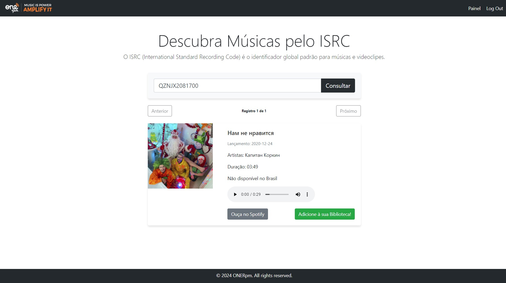

# Descubra Músicas pelo ISRC com Laravel e Angular

Bem-vindo ao projeto Laravel! Este projeto utiliza Laravel 8 com Angular 8 para criar uma aplicação web poderosa.

## Requisitos

- PHP >= 8.2.12
- Docker e Docker Compose
- Node.js >= v16.20.2
- NPM >= 8.19.4
- Composer

## Configuração Inicial

### Clonando o Repositório

Clone o repositório para sua máquina local:

## Docker Sail
Este projeto utiliza o Docker Sail para simplificar o ambiente de desenvolvimento. Você pode iniciar o ambiente Docker Sail com o seguinte comando:
./vendor/bin/sail up

## Instalação de Dependências
Depois de iniciar o ambiente Sail, você precisa instalar as dependências do PHP e do Node.js. Use os seguintes comandos:

- composer install - (Diretório tracks-backend)
- npm install - (Diretório tracks-frontend)

## Configuração do Banco de Dados
Crie um arquivo .env com base no arquivo .env.example e configure suas credenciais de banco de dados.
- cp .env.example .env

Em seguida, gere uma chave de aplicativo: (Diretório tracks-backend)
- sail php artisan key:generate

E execute as migrações do banco de dados: (Diretório tracks-backend):
- sail php artisan migrate --seed

## Rodando o Projeto (Diretório tracks-frontend):
Após a configuração inicial, você pode iniciar o servidor de desenvolvimento com o seguinte comando:
- ng serve

acesse o aplicativo em seu navegador em http://localhost.

### Credenciais de Acesso

Um usuário de teste foi criado durante a execução do seeder `UserCompanySeeder`.

