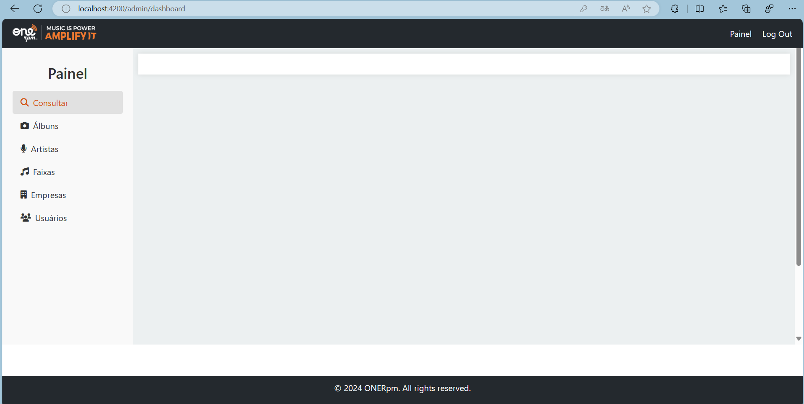

# Descubra Músicas pelo ISRC com Laravel e Angular

Bem-vindo ao projeto Laravel! Este projeto utiliza Laravel 8 com Angular 8 para criar uma aplicação web poderosa.

## Requisitos

- PHP >= 8.2.12
- Docker e Docker Compose
- Node.js >= v16.20.2
- NPM >= 8.19.4
- Composer

## Configuração Inicial

### Clonando o Repositório

Clone o repositório para sua máquina local:

## Docker Sail
Este projeto utiliza o Docker Sail para simplificar o ambiente de desenvolvimento. Você pode iniciar o ambiente Docker Sail com o seguinte comando:
./vendor/bin/sail up

## Instalação de Dependências
Depois de iniciar o ambiente Sail, você precisa instalar as dependências do PHP e do Node.js. Use os seguintes comandos:

- composer install - (Diretório tracks-backend)
- npm install - (Diretório tracks-frontend)

## Configuração do Banco de Dados
Crie um arquivo .env com base no arquivo .env.example e configure suas credenciais de banco de dados.
- cp .env.example .env

Em seguida, gere uma chave de aplicativo: (Diretório tracks-backend)
- ./vendor/bin/sail php artisan key:generate

E execute as migrações do banco de dados: (Diretório tracks-backend):
- ./vendor/bin/sail php artisan migrate --seed

Utilize o comando ./vendor/bin/sail php artisan optimize:clear se necessário para limpar a cache da aplicação

## Rodando o Projeto (Diretório tracks-frontend):
Após a configuração inicial, você pode iniciar o servidor de desenvolvimento com o seguinte comando:
- ng serve

## Autenticação com o Spotify

Para autenticar com o Spotify e utilizar as APIs deles, você precisará registrar o seu aplicativo e obter as credenciais necessárias. Siga os passos abaixo para configurar:

1. Acesse [Spotify Developer Dashboard](https://developer.spotify.com/) e faça login com sua conta Spotify.

2. Clique em `Create an App` para registrar seu novo aplicativo.

3. Preencha as informações solicitadas sobre o seu aplicativo e aceite os termos de uso.

4. Após a criação do aplicativo, você será levado ao Dashboard do seu aplicativo onde você encontrará o `Client ID` e poderá definir um `Client Secret`.

5. Adicione as credenciais ao seu arquivo `.env` da seguinte forma:

SPOTIFY_CLIENT_ID=sua_client_id_aqui
SPOTIFY_CLIENT_SECRET=seu_client_secret_aqui

6. Assegure-se de nunca expor suas credenciais publicamente e de incluir o `.env` no seu `.gitignore`.

Lembre-se de substituir `sua_client_id_aqui` e `seu_client_secret_aqui` pelas credenciais reais do seu aplicativo Spotify.

Para mais informações sobre a autenticação e uso da API do Spotify, consulte a [documentação oficial da API](https://developer.spotify.com/documentation/web-api/).

Acesse o aplicativo em seu navegador em http://localhost:4200/ (Porta padrão do angular. )

### Credenciais de Acesso

Um usuário de teste foi criado durante a execução do seeder [tracks-backend\database\seeders\UserCompanySeeder.php].

Se tudo der certo, você terá a visualização da tela do Painel do sistema.

